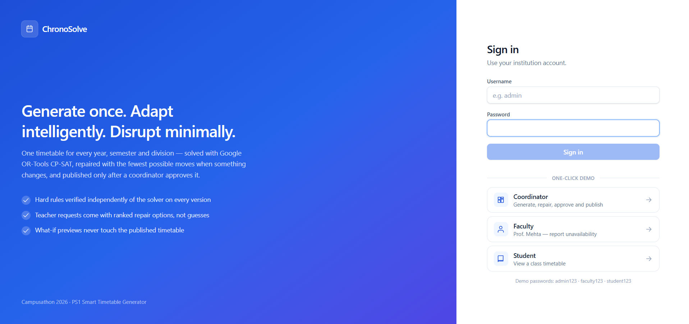
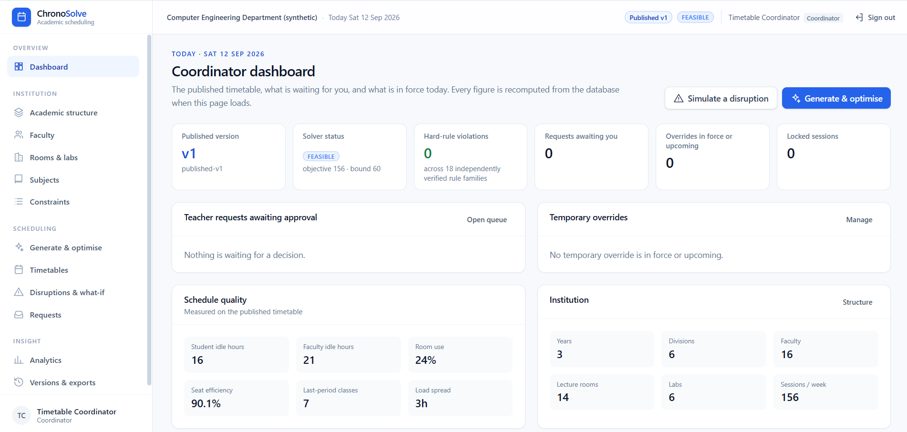
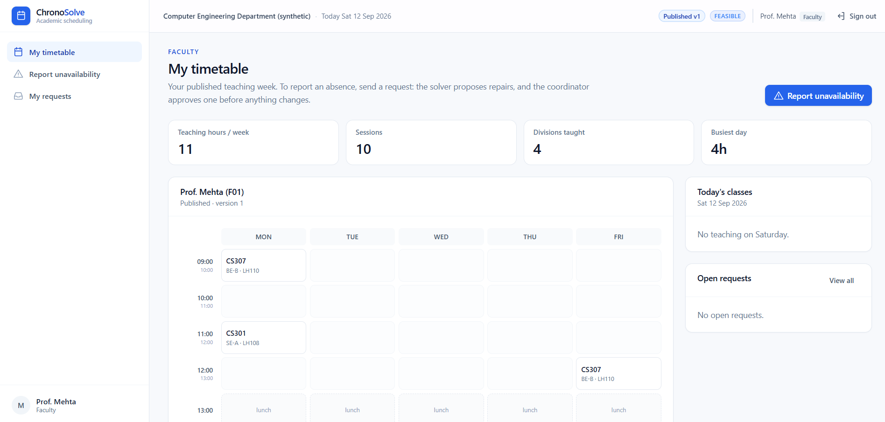
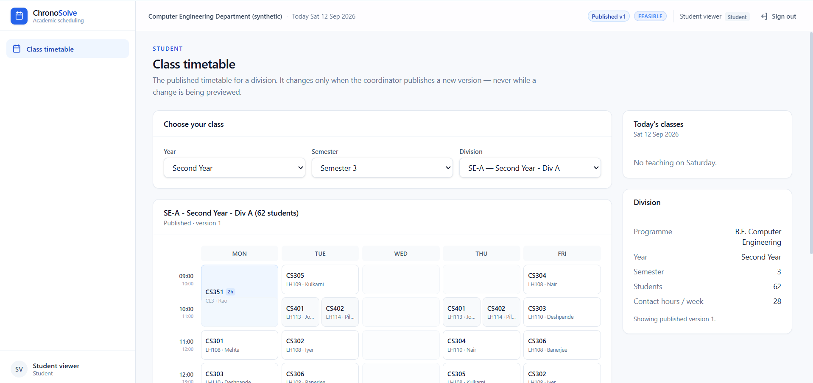
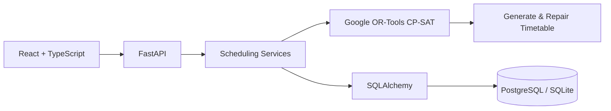

<div align="center">

# ⏱️ ChronoSolve

### Adaptive Constraint-Optimized Academic Scheduling

**Generate Once. Adapt Intelligently. Disrupt Minimally.**

**Campusathon 2026 · PS1 — Smart Timetable Generator**  
**Team 4L's · Team ID: `su-cam-063`**

</div>

---

## 🚀 Overview

**ChronoSolve** is an intelligent academic scheduling platform that generates **conflict-free institutional timetables** and adapts them when real-world disruptions occur.

Academic schedules do not remain static after publication. A faculty member may become unavailable, a laboratory may close, or an institutional rule may change.

Instead of rebuilding the entire timetable, ChronoSolve identifies what is affected and performs a **minimum-disruption repair**.

> ### The goal is not simply to create another valid timetable — it is to preserve the published timetable wherever possible.

<p align="center">
  
</p>

---

## 🎯 Problem Statement

### Campusathon 2026 — PS1: Smart Timetable Generator

Develop an intelligent timetable generation system that creates conflict-free schedules while considering:

- Faculty availability
- Classrooms and laboratories
- Batches and divisions
- Electives
- Room capacity and type
- Faculty workload
- Contact hours
- Institutional scheduling rules

ChronoSolve solves this problem at **two levels**:

**1. Generate a valid timetable.**  
**2. Repair an already-published timetable when reality changes.**

---

## 💡 Why ChronoSolve?

| Traditional Scheduling | ChronoSolve |
|---|---|
| Generates a timetable | Generates **and adapts** a timetable |
| Often requires broad regeneration after disruption | Performs **minimum-disruption repair** |
| Unaffected classes may also move | Preserves unaffected sessions wherever possible |
| Manual trial-and-error | CP-SAT constraint optimization |
| Changes can be difficult to justify | **Explain → Preview → Approve → Publish** |

### ⭐ Core Innovation — Minimum-Disruption Repair

ChronoSolve treats the published timetable as a **baseline**.

When a disruption occurs:

```text
Published Timetable
        ↓
Real-World Disruption
        ↓
Identify Affected Sessions
        ↓
Minimum-Disruption Re-Optimization
        ↓
Compare Proposed Changes
        ↓
Coordinator Approval
        ↓
Updated Published Timetable
```

Repair uses two optimization phases:

**Phase 1 — Stability**  
Minimize how many published sessions must change.

**Phase 2 — Quality**  
Among equally stable repairs, choose the timetable with better scheduling quality.

> **Hard constraints always remain satisfied.**

---

## ✨ Key Features

### 🧠 Constraint-Optimized Scheduling
- Google OR-Tools **CP-SAT**
- Multi-year and multi-division scheduling
- Shared faculty, rooms and laboratories
- Parallel elective scheduling
- Faculty workload constraints
- Room capacity and type validation
- Contiguous laboratory sessions

### 🔄 Adaptive Repair
- Minimum-disruption re-optimization
- Faculty unavailability
- Room/lab closures
- Division disruptions
- Workload-policy changes
- What-if simulation
- Manual move validation
- Session locking
- Old-vs-new timetable comparison

### 👥 Human-in-the-Loop
- Faculty change requests
- Ranked valid repair alternatives
- Auto-select best repair
- Coordinator approval/rejection
- Draft and published versions
- Version history

### 🔍 Explainability
- Why a session moved
- Why another slot is blocked
- Constraint-based explanations
- Infeasibility diagnosis
- Suggested relaxations

### 📤 Institutional Workflow
- Excel import/export
- PDF export
- ICS calendar export
- Role-based access

---

## 👥 Who Uses ChronoSolve?

| Role | What They Can Do |
|---|---|
| **Coordinator / Admin** | Configure academics, generate schedules, simulate disruptions, manage locks, review repairs and publish versions |
| **Faculty** | View personal timetable, report temporary unavailability and choose from valid repair options |
| **Student** | View the latest published timetable for their year, semester and division |

Faculty can request changes, but **only a coordinator can publish the final institutional timetable**.

---

# 🖥️ ChronoSolve in Action

## Coordinator Portal

<p align="center">
  
</p>

The coordinator gets an institution-wide view of the published timetable, solver status, schedule quality, faculty requests, academic structure and active constraints.

From the same workspace, the coordinator can **generate, optimize, simulate disruptions, review repairs and publish new versions**.

---

## Faculty Portal

<p align="center">
  
</p>

Faculty can view their teaching schedule, report temporary unavailability and receive solver-generated repair alternatives.

A faculty request never directly changes the institutional timetable — the coordinator must approve it first.

---

## Student Portal

<p align="center">
  
</p>

Students can select their **year, semester and division** and view the current published timetable.

Previewed or proposed changes are never shown as published until coordinator approval.

---

## 🏗️ Technical Architecture



| Layer | Technology |
|---|---|
| **Frontend** | React + TypeScript |
| **Backend** | FastAPI + Python |
| **Optimization** | Google OR-Tools CP-SAT |
| **Database** | PostgreSQL |
| **Local Fallback** | SQLite |
| **Persistence** | SQLAlchemy + Alembic |
| **Spreadsheet** | openpyxl |
| **Deployment** | Docker |

The scheduling engine is isolated from the database through the repository/service layer.

---

## 🧠 Scheduling Logic

ChronoSolve conceptually models each legal placement as:

```text
x[session, start_timeslot, room]
```

### Hard Constraints

A valid timetable must satisfy:

- No faculty clashes
- No room clashes
- No batch/division clashes
- Faculty and room availability
- Room capacity and type
- Weekly contact hours
- Protected lunch
- Contiguous labs
- Faculty workload limits
- Parallel electives
- Locked sessions

### Soft Optimization

Among valid timetables, ChronoSolve improves:

- Student gaps
- Faculty idle periods
- Workload balance
- Subject distribution
- Room suitability
- Undesirable periods

---

## 🗣️ Scheduling Constraint Assistant

ChronoSolve supports deterministic natural-language constraint entry.

Example:

```text
Prof. Mehta is unavailable after 2 PM on Friday
```

The sentence is converted into a structured candidate rule and shown for confirmation.

```text
Natural Language
      ↓
Structured Rule
      ↓
Validation
      ↓
Preview
      ↓
Human Confirmation
      ↓
CP-SAT Solver
```

The parser **does not generate timetables**.  
Google OR-Tools CP-SAT remains the authoritative scheduling engine.

---

## ⚡ Quick Start

### 1. Clone

```bash
git clone https://github.com/PruthviAvhad/ChronoSolve.git
cd ChronoSolve
```

### 2. Backend Setup

```powershell
python -m venv .venv
.venv\Scripts\activate
pip install -r requirements.txt
```

Run the backend:

```powershell
python -m uvicorn backend.app.api:app --port 8000
```

API documentation:

```text
http://localhost:8000/docs
```

### 3. Frontend Setup

Open another terminal:

```powershell
cd frontend
npm install
npm run dev
```

Open:

```text
http://localhost:5173
```

---

## 👤 Demo Accounts

| Role | Username | Password |
|---|---|---|
| **Coordinator** | `admin` | `admin123` |
| **Faculty** | Teacher surname, e.g. `mehta` | `faculty123` |
| **Student** | `student` | `student123` |

These accounts are provided only for the included **synthetic demonstration environment**.

---

## 🧪 Verification

### Backend Tests

```powershell
python -m pytest
```

### ✅ Latest Verified Result

```text
278 passed
```

The test suite covers:

- Solver constraints
- Timetable generation
- Minimum-disruption repair
- Independent validation
- Role permissions
- Faculty requests
- Persistence
- API workflows

### Frontend Production Build

```powershell
cd frontend
npm run build
```

### ✅ Production Build Verified Successfully

---

## 🐳 Docker

```bash
docker build -t chronosolve .
docker run -p 8000:8000 chronosolve
```

Then open:

```text
http://localhost:8000
```

---

## 📄 Submission Materials

### Campusathon 2026

📊 [**ChronoSolve Final Presentation**](docs/submission/ChronoSolve_PPT.pdf)

📄 [**Project Abstract**](docs/submission/Campusathon_2026_4Ls_Abstract.pdf)

---

## 📚 Research Basis

| Reference | Relevance |
|---|---|
| Müller, Rudová & Barták — *Minimal Perturbation Problem in Course Timetabling* | Minimum-disruption scheduling |
| Schaerf — *A Survey of Automated Timetabling* | Constraint-based timetabling |
| Burke & Petrovic — Automated timetabling research | Timetable optimization |
| Google OR-Tools CP-SAT | Optimization engine |
| National Education Policy 2020 | Flexible academic structures |

---

## ⚠️ Current Scope

ChronoSolve currently uses **synthetic institutional data** for demonstration.

Academic structure, faculty, rooms, laboratories, divisions and scheduling rules are configurable rather than fixed to one institution.

Natural-language input currently supports selected scheduling constraints, while **CP-SAT remains responsible for all timetable generation and repair decisions**.

---

## 👨‍💻 Team

### Team 4L's

**Campusathon 2026**

**Problem Statement:** PS1 — Smart Timetable Generator  
**Team ID:** `su-cam-063`

---

<div align="center">

# ⏱️ ChronoSolve

### Generate Once. Adapt Intelligently. Disrupt Minimally.

**Valid Schedules · Intelligent Adaptation · Minimum Unnecessary Change**

</div>